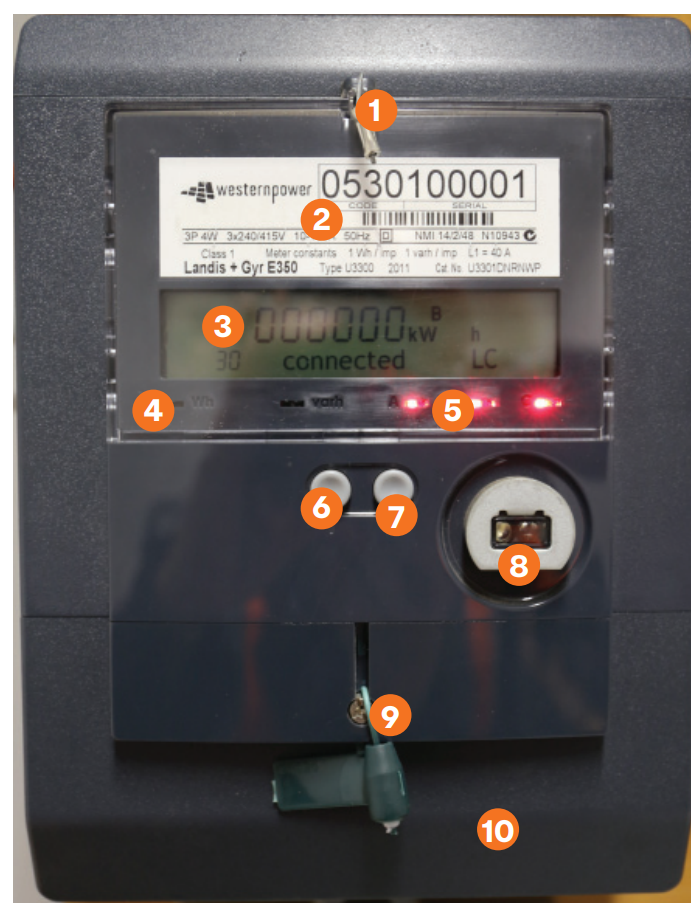

[](https://travis-ci.com/SrzStephen/PowerLogger)
# PowerLogger


My power company has rolled out ["smart meters"](https://www.smart-energy.com/industry-sectors/smart-meters/western-power-announces-state-wide-238000-smart-meter-roll-out/). While these smart meters (LANDIS + GYR E350) have a RJ-11 port that you could feasably read off of, it's been locked down (how smart) so your normal option for getting your data is by asking Western Power twice a year for a dump of your data (unknwon resolution). I want a much higher resolution and to recieve the data much closer to real time, so this is a no go for me. I don't want to overly tamper with my energy meter because that just looks bad and will probably get me in trouble.

My (not original) super hacky workaround to this limitation is to read the 1 pulse/watt LED (Marked as 4 on the diagram above) using an esp32, a 10KΩ resistor and a photoresistor (TODO: Connection Diagram). 

I send off a count of pulses recieved per 20 second interval (or whatevers defined in Settings_Config.h) and send it to an influxDB instance through a http POST.
```zsh
energy_meter_reading,device=esp32_MeterReader,version=0.0.1,compiled=Jun 30 2019 value=14 1561897501 
energy_meter_reading,device=esp32_MeterReader,version=0.0.1,compiled=Jun 30 2019 value=23 1561897521
energy_meter_reading,device=esp32_MeterReader,version=0.0.1,compiled=Jun 30 2019 value=15 1561897543 
```
where device,version,compiled are tags, energy_meter_reading is the measurement(metric), value is the numeric value associated with that measurement and timestamps are on the end as UTC epoch timestamps.

The ADC pulse detection runs on core 1 of the esp32, and the posting runs on core 2 so I can try to avoid data loss as much as possible. Because of this dependence on two cores this will not work on an esp8266 and there are no plans to make it compatable. Both cores share a common mutex lock to prevent race conditions. 
Non 200-responses will trigger a retry in sending the data. 

I use [PlatformIO](https://platformio.org/) to manage my libraries/board configurations, so if you download/install it things become trivially easy to set up on windows/mac/linux.
Things that you will need to modify are contained within include/Settings_Config.h.
